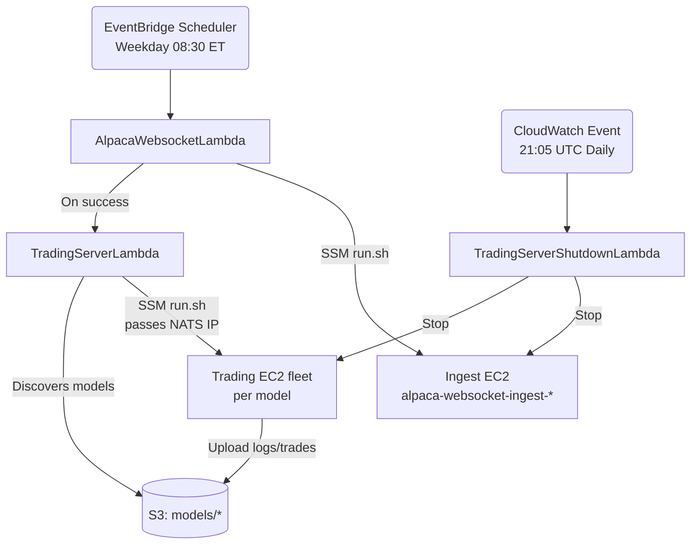
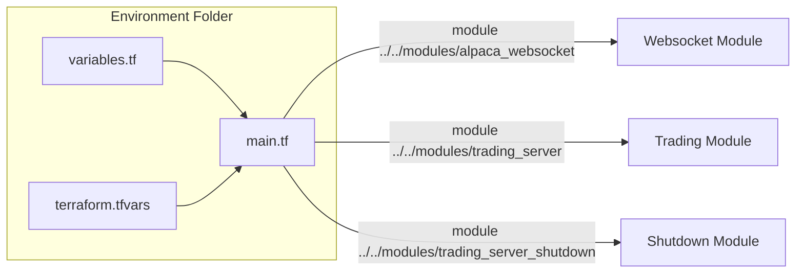

# Terraform Algo Trading Stack

This repository provisions a complete end-to-end algorithmic trading environment on AWS. Terraform modules in `modules/` define reusable building blocks (websocket ingest, trading fleet, scheduled shutdown), while `environments/{dev,qa,prod}` wire those modules together with per-environment defaults.

## Architecture at a Glance

High-level flow:

1. **Archive & packaging** – Each module zips its folder (excluding Terraform files) for Lambda deployment; runtime files live alongside Terraform.
2. **Websocket ingest** – EventBridge can trigger `AlpacaWebsocketLambda` to start the ingest EC2 instance, verify both EC2 status checks, and run `run.sh` via SSM to bootstrap the Alpaca websocket, NATS server, and Streamlit dashboard.
3. **Trading fleet** – On a successful ingest invocation, Lambda destinations optionally chain into `TradingServerLambda`, which starts every model-specific EC2 instance, injects the ingest node's public IP, and executes its own `run.sh` to launch trading jobs that publish logs/trades to S3.
4. **Safety shutdown** – A scheduled Lambda runs in QA/Prod to stop every ingest/trading instance each evening, ensuring costs stay bounded.

---

## Module Inventory

### `modules/alpaca_websocket`

**Purpose**: Provision a single EC2 ingest host plus a controller Lambda that can be invoked manually, by EventBridge Scheduler, or as part of trading workflows.

- **Infrastructure** (`main.tf`): Creates the ingest EC2 instance with environment-specific IAM role, Secrets Manager + S3 access, SSM attachment, and tags (`Name=alpaca-websocket-ingest-${var.environment}`).
- **Controller Lambda** (`lambda.tf`, `lambda_function.py`): Packages the module directory and deploys `AlpacaWebsocketLambda_${environment}`. The handler:
  - Finds the ingest instance by tag, starts it if needed, and retries EC2 status checks (`ensure_healthy`) before proceeding.
  - Pulls the co-located `run.sh`, splits it into commands, and sends it through `ssm:SendCommand`.
  - Returns the stdout/stderr from the SSM invocation for observability.
- **Runtime script** (`run.sh`): Uses the `github/ssh-key` secret to clone `kayvonavishan/algo-modeling-v2`, starts `nats-server`, runs the Alpaca ingestion script, and launches the Streamlit dashboard. The script expects `deployment_config.txt` (written via user data) for bucket and branch inputs.
- **EventBridge Scheduler** (`event_bridge.tf`): When `enable_eventbridge = true`, creates:
  - An IAM role for Scheduler to invoke the Lambda.
  - A weekday cron schedule (08:30 ET) named `alpaca-websocket-lambda-daily-9am-est-${environment}`.

Inputs of note:

| Variable | Description |
| --- | --- |
| `ami_name_filter` | AMI name pattern for the ingest instance lookup. |
| `git_branch` | Passed to both EC2 user-data and SSM script to pick the repo branch. |
| `enable_eventbridge` | Toggles the scheduler resources. |

Outputs include the instance ID and Lambda name for downstream modules.

### `modules/trading_server`

**Purpose**: Discover model artifacts in S3 and create a per-model EC2 fleet plus a controller Lambda that can orchestrate instance lifecycle and trading script execution.

- **S3-driven fleet** (`main.tf`):
  - Uses `aws_s3_objects` to enumerate `models/<model_type>/<symbol>/<model_id>-outer_X_inner_Y...`.
  - Derives `local.model_info_attrs`, creating one `aws_instance` per unique model prefix with tags `Name=trading-server-${environment}-${symbol}-${model_type}-${model_number}`.
  - User data writes `deployment_config.txt` with bucket/model metadata and desired git branch.
  - Grants IAM permissions for Secrets Manager, S3 list/get/put, and attaches `AmazonSSMManagedInstanceCore`.
- **Controller Lambda** (`lambda.tf`, `lambda_function.py`):
  - Packages the module folder into `TradingServerLambda_${environment}`.
  - Handler ensures the ingest host is running and captures its public IP (used as `NATS_PUBLIC_IP`), starts any stopped trading instances, retries EC2 health checks (`ensure_healthy`), and sends `run.sh` through SSM with the NATS IP prepended as an environment export.
  - Gathers SSM command results per instance for logging.
- **Runtime script** (`run.sh`):
  - Installs/starts `crond`, clones or refreshes `algo-modeling-v2`, and persists `nats_public_ip` inside `deployment_config.txt`.
  - Creates `/usr/local/bin/upload_app_log.sh`, which syncs `live_trader.log` and `trades_*.csv` to the model's S3 prefix, and schedules it every 15 minutes.
  - Launches `deployment/live_trader.py` in the background via Python 3.12.
- **Event chaining** (`event_bridge.tf`):
  - When `enable_eventbridge = true`, grants `AlpacaWebsocketLambda` permission to invoke `TradingServerLambda`.
  - Creates an `aws_lambda_function_event_invoke_config` so a successful async invocation of the ingest Lambda automatically triggers the trading Lambda (no event bus fuzz).

Notable inputs:

| Variable | Description |
| --- | --- |
| `bucket_name` | S3 source of models and sink for logs/trades. |
| `websocket_instance_name` | Tag-based lookup for the ingest EC2 (defaults to `alpaca-websocket-ingest-${environment}`). |
| `git_branch` | Ensures ingest and trading fleets stay on the same repo revision. |

Outputs expose `model_info_attrs`, `instance_info`, and the Lambda name for integrations.

### `modules/trading_server_shutdown`

**Purpose**: Provide a daily guardrail that stops every ingest/trading instance in higher environments.

- **Lambda** (`lambda.tf`, `lambda_function.py`): Packages the module folder as `TradingServerShutdownLambda_${environment}`. The handler stops every instance tagged `alpaca-websocket-ingest-${environment}` or `trading-server-${environment}-*` unless it is already stopped.
- **Schedule**: A CloudWatch Events rule named `trading-server-shutdown-schedule-${environment}` runs at `cron(5 21 * * ? *)` (21:05 UTC ≈ 17:05 ET) and targets the shutdown Lambda. Permissions are scoped through `aws_lambda_permission`.
- **Configuration**: Minimal variables—`aws_region` (from the calling environment) and `environment`.

---

## Environment Entrypoints (`environments/`)

Each environment folder is a self-contained Terraform root. `main.tf` wires modules, `variables.tf` defines defaults, and `terraform.tfvars` sets concrete values for deployment. Run Terraform from each directory independently (e.g., `cd environments/qa && terraform init && terraform plan -var-file=terraform.tfvars`).

### Environment matrix

| Environment | EventBridge enabled? | Shutdown module? | Default bucket | Default git branch | Notes |
| --- | --- | --- | --- | --- | --- |
| `dev` | No (manual runs via CLI) | No | `algo-model-deploy-dev` | `feature/dev` | Cheapest `t2.small` sizing; good for iterative tests. |
| `qa` | Yes (scheduler + Lambda chaining) | Yes | `algo-model-deploy` | `main` | Mirrors production timing but with QA AMIs. |
| `prod` | Yes | Yes | `algo-model-deploy-prod` | `live` | Uses production bucket/branch; same architecture as QA. |

### Highlights per environment

- **Development (`environments/dev`)**
  - Disables EventBridge to keep ingest/trading Lambdas fully manual.
  - Omits the shutdown module so dev instances persist until manually stopped.
  - Defaults to lighter-weight instance types but accepts overrides through `terraform.tfvars`.

- **QA (`environments/qa`)**
  - Enables EventBridge scheduler and Lambda chaining (`enable_eventbridge = true` in both modules) to exercise automation.
  - Includes the shutdown module to enforce daily cost controls.
  - Targets the QA bucket/branch combo for regression testing of model assets.

- **Production (`environments/prod`)**
  - Matches QA module wiring but points to the production S3 bucket and `live` git branch.
  - EventBridge scheduler plus shutdown automation run daily to keep ingest/trading cycles predictable.

---

## Operating Terraform

1. **Initialize** – From the environment folder: `terraform init`.
2. **Format & validate** – Run `terraform fmt -check` and `terraform validate` to ensure style + syntax match repository standards.
3. **Plan & apply** – `terraform plan -var-file=terraform.tfvars -out plan.out`, then `terraform apply plan.out`.
4. **Destroy** (when needed) – `terraform destroy -var-file=terraform.tfvars`.

### Validation checklist

- **Formatting**: `terraform fmt -check` passes in every module and environment touched.
- **Static validation**: `terraform validate` runs clean.
- **Plan review**: Capture and review `terraform plan` output per environment before applying.
- **Lambda package contents**: Ensure every runtime file (Python, `run.sh`, helpers) lives at the module root so `data.archive_file` includes it automatically.
- **Instance prerequisites**: AMIs should already contain `boto3`, `awscli`, `jq`, SSM Agent, and required Python versions.

---

## Naming & Tagging Reference

- Ingest EC2: `alpaca-websocket-ingest-${environment}`.
- Trading EC2: `trading-server-${environment}-${symbol}-${model_type}-${model_number}`.
- Lambda functions: `AlpacaWebsocketLambda_${environment}`, `TradingServerLambda_${environment}`, `TradingServerShutdownLambda_${environment}`.
- IAM roles follow `<component>_<resource>_${environment}` to keep trust policies scoped per environment.

These conventions are baked into the Lambdas’ discovery logic—changing them requires coordinated Terraform and runtime updates.
